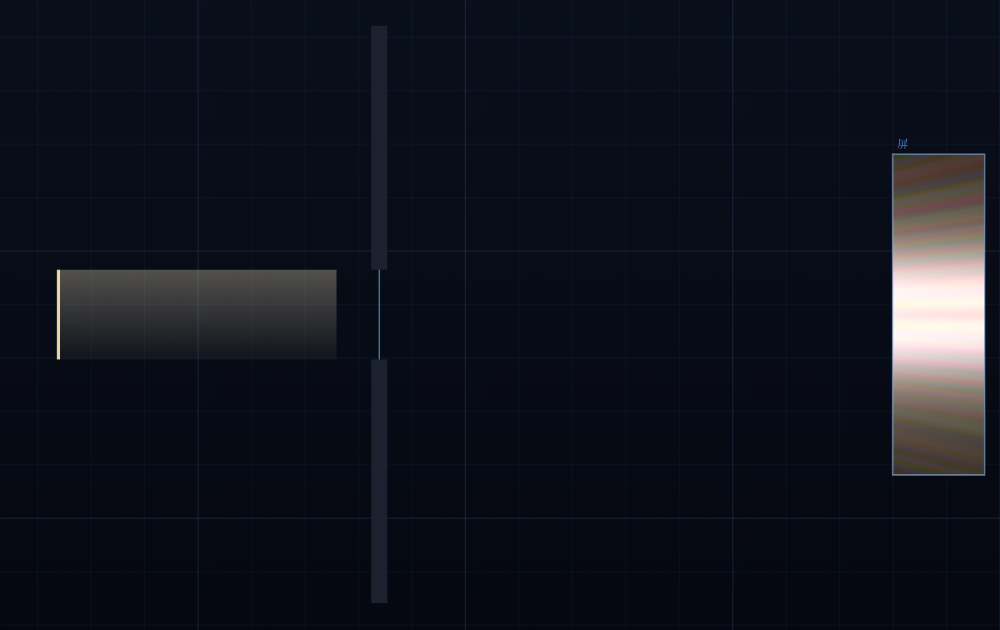
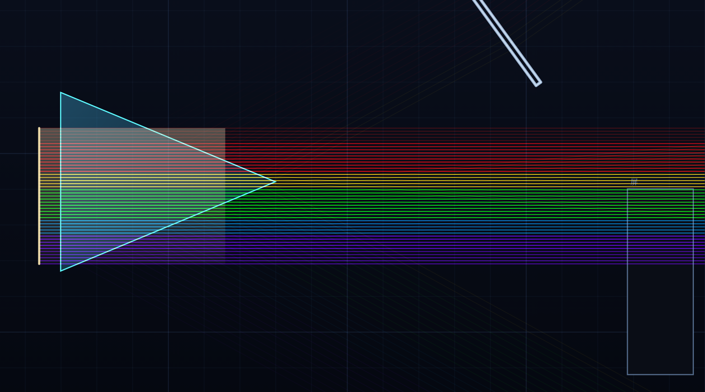
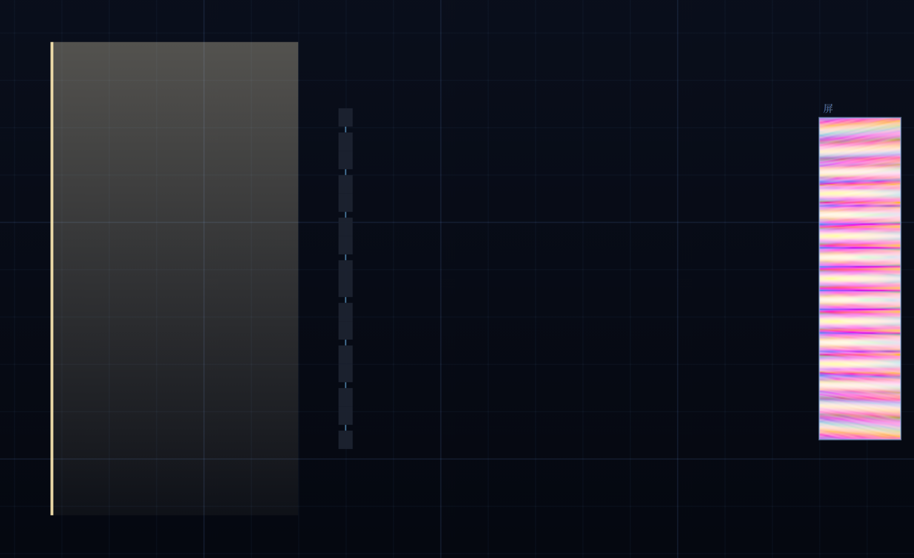
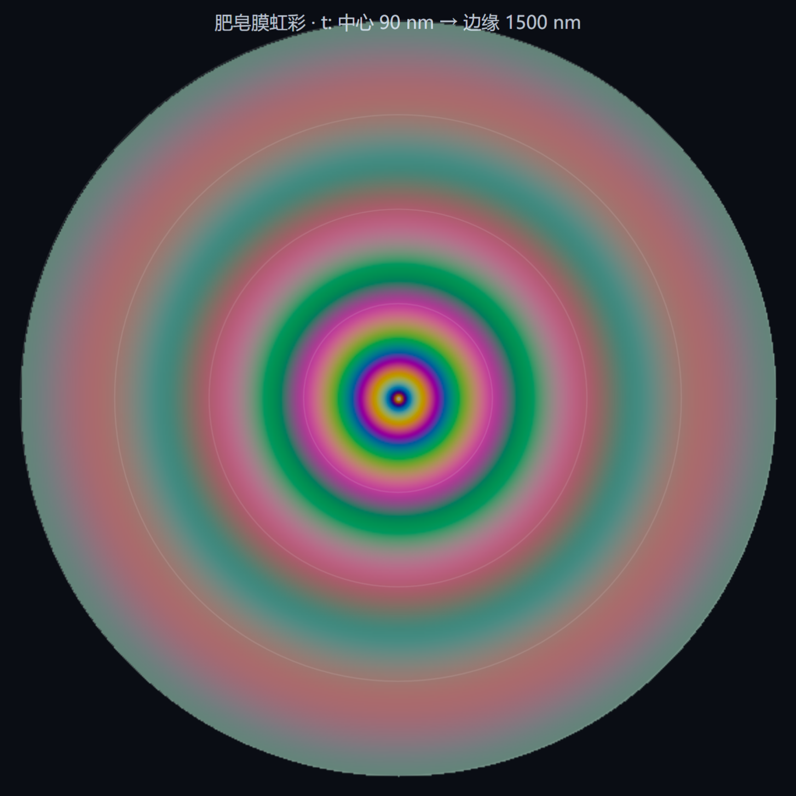
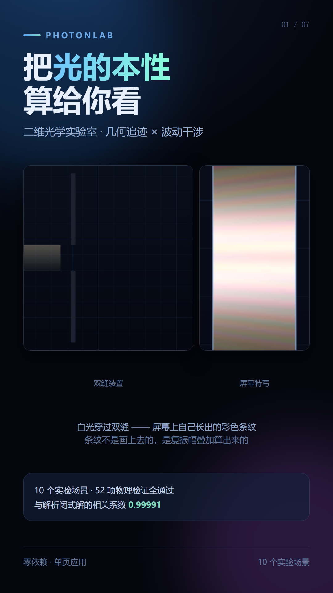
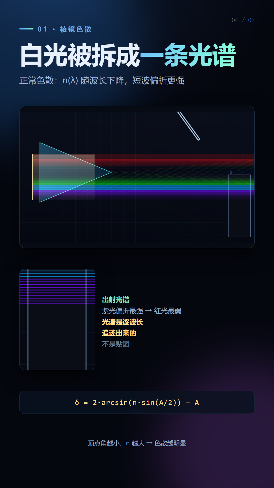
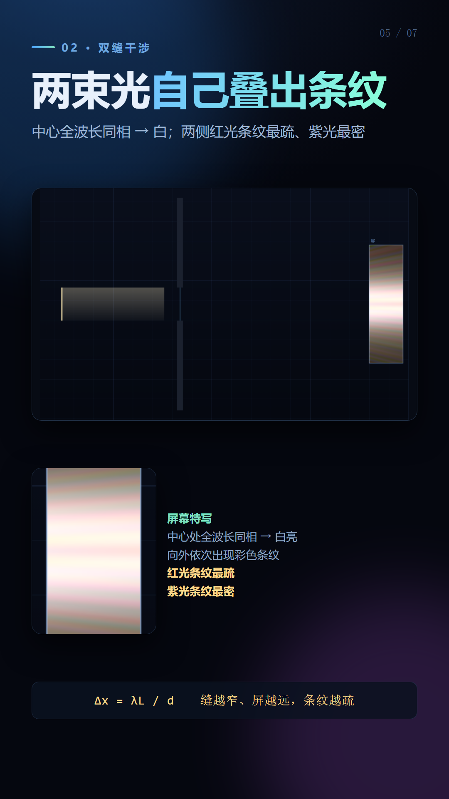
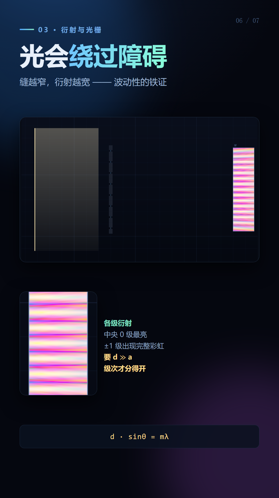
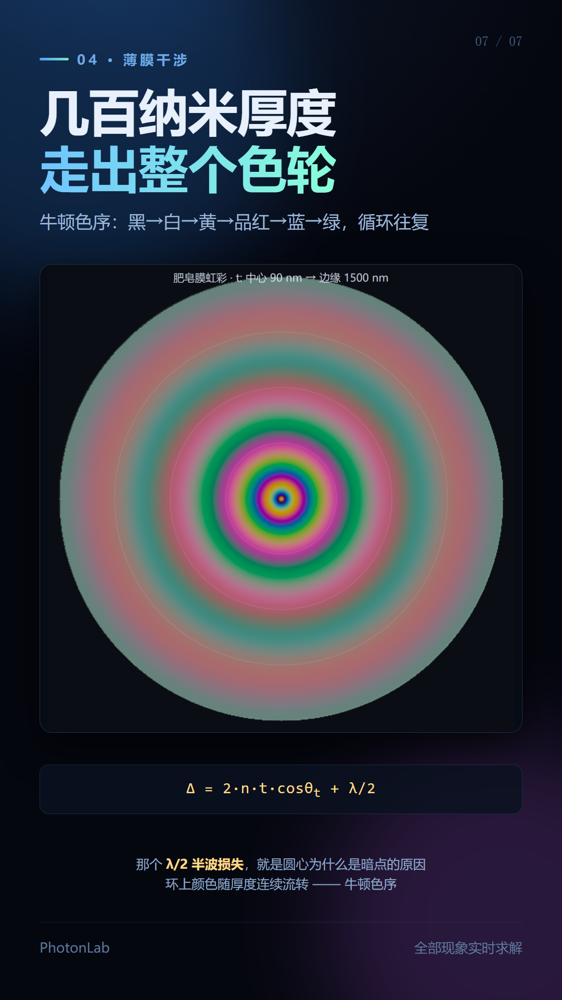

<div align="center">

# PhotonLab · 二维光学实验室

**把光的本性，算给你看**

几何光线追迹 × 波动干涉 · 零依赖单页应用

[](verify-report.md)
[]()
[]()

</div>

---

## 这是什么

一个能实时求解**十种经典光学实验**的浏览器沙盒。

屏幕上的每一条干涉条纹、每一道彩虹光谱、每一圈牛顿环，
**都是算出来的**——没有一张预渲染的贴图，没有一行硬编码的条纹公式。
改变任意参数，结果必然发生**符合物理定律**的变化。

| 场景 | 现象 |
|:--|:--|
|  | **双缝干涉** —— 白光穿过双缝，中心白亮、两侧彩色条纹 |

---

## 为什么需要波动层

一个反直觉的事实：

> **纯几何光线追迹，永远看不到干涉和衍射。**

光线只会直走、折射、反射。让一万条光线通过双缝，
几何光学的结果依然是"两条亮线"——它原理上不知道干涉为何物。

条纹来自**惠更斯原理**：波面上的每一点都是二级波源。
把缝隙开口上的每一点当作独立波源，各带自己的相位，
向屏幕辐射，再把复振幅加起来——条纹就自己长出来了。

```
E(P) = Σⱼ  aⱼ · e^(i·k·dⱼ) / √dⱼ
```

本项目把这个积分**实时**做完，并对每个波长独立求解，
最后按 CIE 1931 配色函数合成为真实颜色。
所以干涉的彩色是**涌现**的，不是画上去的。

---

## 十个实验场景

| | 场景 | 演示的物理 | 关键公式 |
|:--|:--|:--|:--|
| 1 | **棱镜色散** | 正常色散、最小偏向角 | `δ = 2·arcsin(n·sin(A/2)) − A` |
| 2 | **双缝干涉** | 白光彩色干涉条纹 | `Δx = λL/d` |
| 3 | **单缝衍射** | 衍射包络与次瓣 | `I(θ) = I₀·sinc²(πa·sinθ/λ)` |
| 4 | **光栅光谱** | 多缝衍射、衍射级次 | `d·sinθ = mλ` |
| 5 | **圆孔衍射** | 爱里斑、瑞利判据 | `sinθ = 1.22λ/D` |
| 6 | **迈克尔逊干涉仪** | 分光双臂干涉 | `Δ = 2(n−1)·d` |
| 7 | **透镜与色差** | 紫焦点近于红焦点 | `1/f = (n−1)(1/R₁−1/R₂)` |
| 8 | **全反射光纤** | 光导原理 | `θc = arcsin(n₂/n₁) ≈ 41.2°` |
| 9 | **牛顿环** | 等厚干涉、暗环 | `r_m = √(mλR)` |
| 10 | **肥皂膜虹彩** | 牛顿色序 | `Δ = 2nt·cosθ_t + λ/2` |





---

## 快速开始

**零依赖，零构建。** 只需要一个静态服务器（因为 ES Module 不能走 `file://`）。

```bash
git clone https://github.com/qw101233/photon-lab.git
cd photon-lab
python -m http.server 8000
```

浏览器打开 <http://localhost:8000> 即可。

> Windows 下如果 `python` 不可用，用 `npx serve` 或任意静态服务器均可。

### 操作方式

| 操作 | 效果 |
|:--|:--|
| 拖拽元件 | 移动镜子/棱镜/缝隙，实时看到光路变化 |
| 滚轮 | 旋转镜面与分光镜 |
| 顶部标签 | 切换十个实验场景 |
| 右侧滑块 | 波长、线宽、动态范围、光束宽度、缝宽、膜厚… |

---

## 项目结构

```
photon-lab/
├── index.html            入口（单页，含 UI）
├── src/
│   ├── vec.js            二维几何原语（向量 / 求交 / 凸多边形）
│   ├── optics.js         Snell 折射 · Fresnel 反射 · Cauchy 色散
│   ├── spectrum.js       CIE 配色函数 · 波长↔场景单位换算
│   ├── tracer.js         几何光线追迹（路径 + 二级波源）
│   ├── wave.js           惠更斯-菲涅尔场计算 · CIE 合成 · 对数映射
│   ├── film.js           薄膜干涉解析解 · 牛顿环
│   ├── scenes.js         十个场景定义
│   └── app.js            渲染管线 · 交互 · 参数面板 · 调试 API
├── tools/
│   ├── verify.js         52 项物理断言
│   ├── qc.js             画面质量量化检查
│   ├── shot.js           截图生成
│   └── slides.js         9:16 图文生成
├── shots/                全部图片产物
├── verify-report.md      验证报告
└── PROJECT.md            详细项目文档（含开发踩坑记录）
```

---

## 验证

本项目把**物理定律本身**作为断言目标，而不只是检查画面是否好看。

```bash
set NODE_PATH=<playwright所在目录>/node_modules
node tools/verify.js
```

```
════════════════════════════════════════════
结果：52/52 通过
════════════════════════════════════════════
```

部分结果：

| 断言 | 结果 |
|:--|:--|
| 玻璃→空气临界角 = arcsin(n₂/n₁) | `41.25°` vs 理论 `41.25°` |
| 正入射 Fresnel R = ((n₁−n₂)/(n₁+n₂))² | `0.04216` vs `0.04216` |
| 布儒斯特角 p 分量反射率 = 0 | `Rp = 0.00e+0` |
| 双缝数值解 vs 解析闭式解（相关系数） | **0.99991** |
| 单缝数值解 vs 解析 sinc²（相关系数） | **1.000000** |
| 牛顿环 r₄/r₁ = 2 | `2.000000` |
| 源采样 25→400 收敛性（相关系数漂移） | `< 0.1%` |

完整明细见 [verify-report.md](verify-report.md)。

### 验证方法学

开发过程中，这套测试框架**自己出错了四次**，每次错的都是测试而非引擎：

1. 拿不同屏距下的主瓣宽度作比 → 被屏距差异污染
2. 把 `N_d > 1` 判为失败 → 夫琅禾费判据只该用缝宽 `a`
3. 不同分辨率的场直接比像素数 → 换算成物理单位后其实早已收敛
4. 断言"单缝轴上必为主峰" → 那是远场公式，近场本就不成立

**最终采用的方法：把整条强度剖面与解析闭式解逐点比对（归一化互相关）。**
这比提取单个特征量强得多——一次同时验证条纹位置、明暗对比与包络形状，
还绕开了峰值检测的像素级误差。相关系数 `0.99991` 意味着
**数值解与解析解几乎逐点一致**。

---

## 实现要点

### 单位约定（最容易踩的坑）

场景坐标是抽象的**场景单位 (su)**，而波长是物理 nm。
物理公式 `λL/d` 要求三者同单位，因此必须有显式换算：

```js
// spectrum.js
export const WAVE_SCALE = 0.0035;
export const nmToSu = (nm) => nm * WAVE_SCALE;
```

为什么需要它：真实双缝的条纹间距是**亚毫米**的，肉眼在米级屏幕上根本分辨不出
（真实实验要靠透镜放大或几十米长的管子）。本仿真把整个装置压进 1000×620 的画面，
所以必须放大波长才能看见条纹。

这个系数**只影响"看见多少条"**，不影响任何物理关系：
Snell/Fresnel 只依赖 n 的比值，临界角与波长无关，条纹间距严格正比于 λ。

### 对数强度映射

光栅的 0 级比 ±1 级强约 100 倍（N² vs 1）。线性映射下 ±1 级直接过曝淹没，
屏上只看得见一条白亮带——看起来像"只有零级"。真实实验也是用对数底片
或高动态范围 CCD 拍光谱的。

### 性能

波动层占了 90%+ 的计算时间。三处关键优化使光栅场景从 20 秒降到 0.2 秒：

| 优化 | 效果 |
|:--|:--|
| 相位查表 + 线性插值（8192 项，误差 <1e-5） | **4×** |
| 源数上限按实测收敛性设定（每波长 400 源已饱和） | 大幅 |
| 三角函数表 + 平方距离预计算 | 2× |

---

## 9:16 图文

七张竖屏图文（1080×1920），依次呈现项目简介、技术原理与成果展示。

| | |
|:--|:--|
|  |  |
|  |  |
|  |  |
|  | |

重新生成：

```bash
node tools/shot.js      # 先出场景截图
node tools/slides.js    # 再拼图文
```

---

## 调试 API

在浏览器控制台里直接驱动：

```js
photonLab.loadScene('rings')    // 切换场景
photonLab.set('lam', 600)       // 改状态字段并重绘
photonLab.profile()            // 屏幕中心线强度剖面
photonLab.countFringes()       // 条纹计数
photonLab.getFields()          // 各波长复振幅场
photonLab.quality()            // 场的收敛质量指标
```

---

## 许可

MIT
